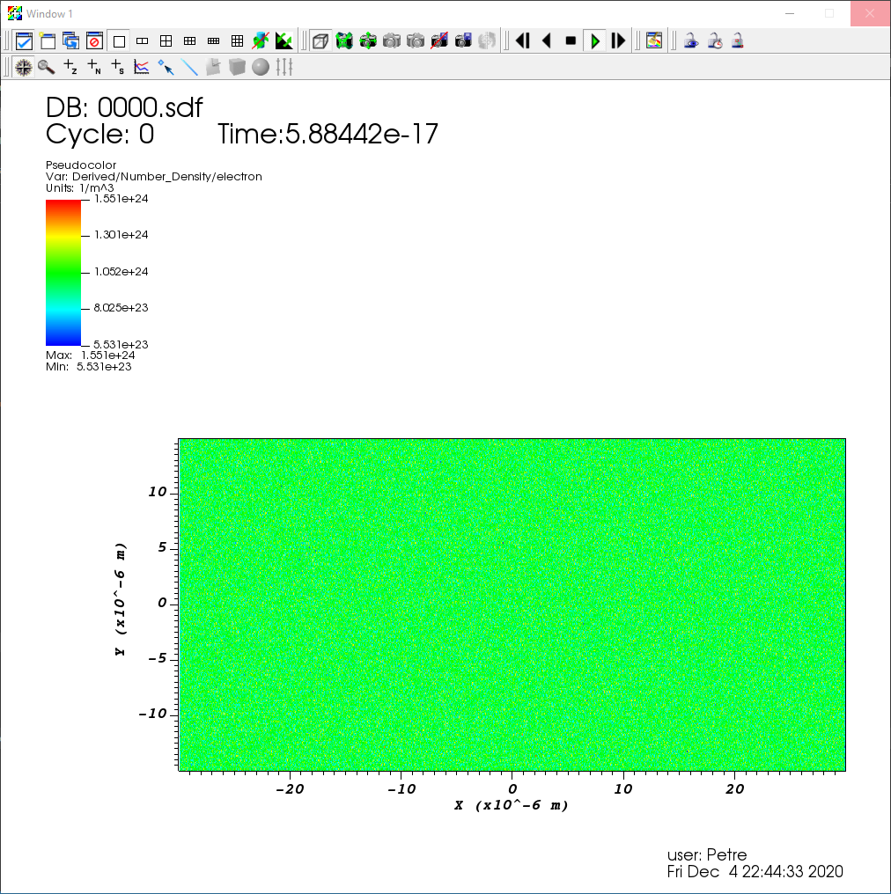

# VisIt method for viewing simulation results

1. First, you have to install the VisIt client on you local machine. Download it from https://wci.llnl.gov/simulation/computer-codes/visit/executables. You will need v3.1.2 or newer.

2. From `Options` menu choose `Host Profiles` (or press `CTRL+H`)

  

3. In the new window, create a new profile by pressing `New Host` button (bottom-left) and fill in the following fields:
- **Host nickname** - a name for your host
- **Remote host name** - IP/domain provided by the administrator
- **Path to VisIt installation** - `/mnt/storage/singularity-recipes/epoch`
- **Username** - your username
- Mark **Tunnel data trough SSH** and **SSH command**
- In the **SSH command** section, type `ssh -P port` where `port` is the port provided by the administrator

  

Now press `Apply` from the bottom-left of the window and `Dismiss` from the bottom-right of the window.

4. Press `Open` in `Sources` and, from the newly open window, choose the correspoding host and press `ENTER`.

  

5. Type in your password in the newly open window and press `OK`.

## Viewing simualtion results (demo)

1. Navigate to `/mnt/storage/epoch/oneil2017/bubble_i17`, choose the `.sdf` database and press `OK`.

  

2. From `Plots`, click `Add -> Pseudocolor -> Derrived -> Number density -> Number density -> Electrons`, and then click `Draw`.

  

3. You should obtain the Number density, as shown below

  

